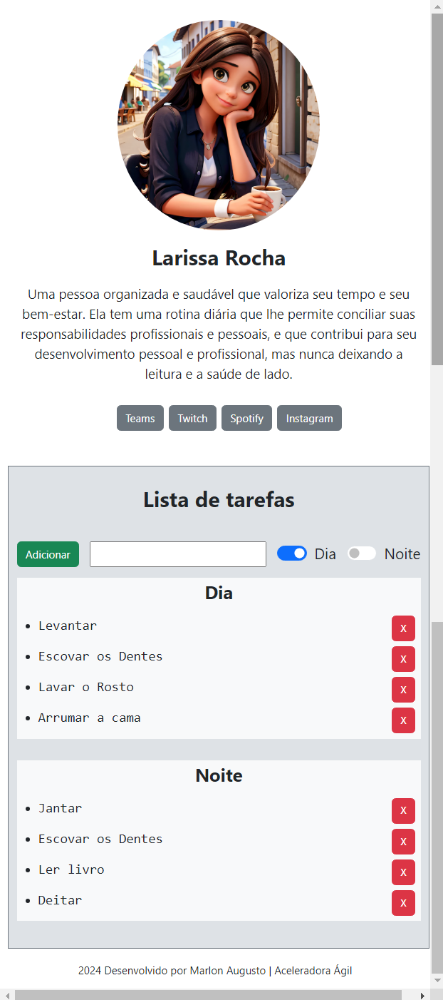
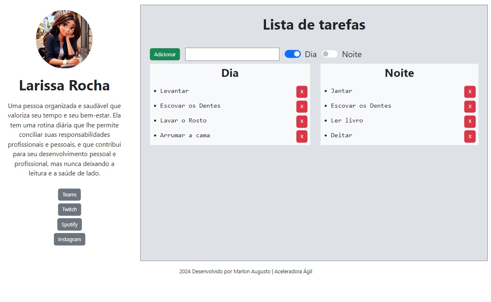
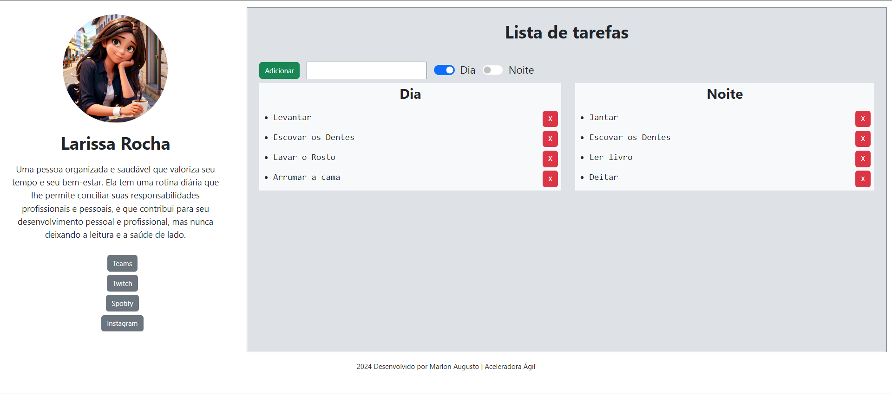

# HTML/CSS

### Criado layout de largura e altura variável de acordo com o conteúdo da página, dividido em duas regiões distintas (menu esquerdo e conteúdo principal), seguindo as instruções abaixo

- No menu esquerdo, coloque uma imagem de um ícone padrão, um Nome genérico abaixo da imagem e
um texto.

- Para criar uma formatação para o menu esquerdo com os 4 links, utilize a estrutura abaixo e crie uma formatação para esse menu.

```html
<ul>
<li><a href=”#”>Link1</a></li>
<li><a href=”#”>Link2</a></li>
<li><a href=”#”>Link3</a></li>
<li><a href=”#”>Link4</a></li>
</ul>
```

- Na área principal, crie um título chamado "Lista de tarefas" e adicione uma tabela Dia e Noite
lado a lado. Em cada tabela, crie uma lista ordenada com tarefas genéricas a serem feitas
durante uma rotina.

## Desafio

> Para aprimorar a experiência do usuário, aplique um estilo personalizado ao layout,tornando-o mais agradável e intuitivo..

> Deixe a lista de tarefas dinâmica com as funcionalidades de adição e remoção de tarefas.

---

## Tecnologias usadas
- HTML
- CSS
- Bootstrap
- Javascript


#### Imagem do personagem gerado pela [SeaArt](https://www.seaart.ai/pt)

<details>
<summary> <h1>Minhas escolhas</h1> </summary>

>Optei por utilizar o Bootstrap para encurtar o tempo e por ter feito um curso recentemente de LandingPage e estar fresco na memória.


<details>
<summary> <h2>Devices</h2> </summary>

### Mobile


---

### Tablet


---
### Desktop


</details>
<details>
<summary> <h3>Funcionamento</h3> </summary>

### Inicio

---
### Tarefa sendo criada

---
### Tarefa criada

---
### Tarefas sendo removida

---
### Tarefa removida


</details>
</details>
